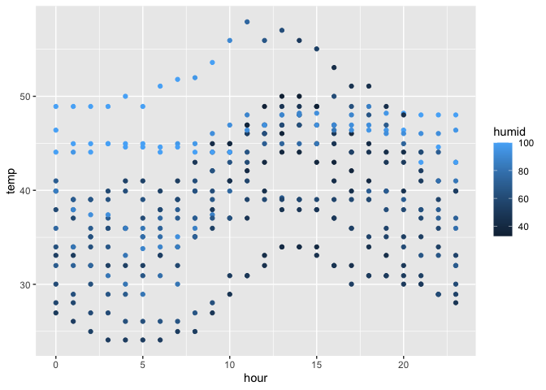

P8105_HW1
================
Haley Zylberberg, hmz2105

# Problem 1: This problem focuses the use of inline R code, plotting, and the behavior of ggplot for variables of different types.

To start, download the penguins dataset in the console directly.

Next, call in moderndrive and tidyverse library.

``` r
library(moderndive)
library(tidyverse)
```

    ## ── Attaching core tidyverse packages ──────────────────────── tidyverse 2.0.0 ──
    ## ✔ dplyr     1.1.3     ✔ readr     2.1.4
    ## ✔ forcats   1.0.0     ✔ stringr   1.5.0
    ## ✔ ggplot2   3.4.3     ✔ tibble    3.2.1
    ## ✔ lubridate 1.9.2     ✔ tidyr     1.3.0
    ## ✔ purrr     1.0.2     
    ## ── Conflicts ────────────────────────────────────────── tidyverse_conflicts() ──
    ## ✖ dplyr::filter() masks stats::filter()
    ## ✖ dplyr::lag()    masks stats::lag()
    ## ℹ Use the conflicted package (<http://conflicted.r-lib.org/>) to force all conflicts to become errors

Load early_january_weather dataset.

``` r
data("early_january_weather")
```

Examine the dataset using the help and View functions.

``` r
help(early_january_weather)
View(early_january_weather)
```

The dataset ‘Early January Weather’ depicts the hourly meterological
data for the airport EWR for the month of January 2013. There are 358
rows and 15 columns (i.e. variables) in the dataset. The variable names
are origin, year, month, day, hour, temp, dewp, humid, wind_dir,
wind_speed, wind_gust, precip, pressure, visib, time_hour.

- The following are summary statistics:
  - The mean temperature in F is 39.5821229 (SD 7.058637), with minimum
    value 24.08 and maximum value 57.92.
  - The mean dewpoint in F is 28.057095 ( SD 10.7260695), with minimum
    value 8.96 and maximum value 53.06.
  - The mean humidity is 65.4767039 (SD 18.9453049), with minimum value
    32.86 and maximum value 100.
  - The mean wind speed in mph is 8.2258269 (SD 4.6116356), with minimum
    value 0 and maximum value 24.16638.
  - The mean precipitation in inches is 0.0020391 (SD 0.0132008), with
    minimum value 0 and maximum value 0.19.
  - The mean visibility in miles is 8.5153352 (SD 2.9971051), with
    minimum value 0.12 and maximum value 10.
  - Statistics could not be obtained for the variables wind gust, wind
    direction, and pressure due to missing variables (308 missing values
    for wind gust, 5 missing values for wind direction, and 38 missing
    values for pressure).

Next make a scatterplot of temp (y) vs time (hour) adding in color
points with the humid variable.

``` r
ggplot(early_january_weather, aes(x = hour, y = temp, 
color = humid)) + geom_point()
```

<!-- -->

Next save plot.

``` r
ggsave("scatter_plot_HW1.pdf", height = 4, width = 6)
```

This scatterplot shows that

# Problem 2: This problem is intended to emphasize variable types and introduce coercion; some awareness of how R treats numeric, character, and factor variables is necessary for working with these data types in practice.

- Will create a data frame comprised of:
  - a random sample of size 10 from a standard Normal distribution
  - a logical vector indicating whether elements of the sample are
    greater than 0
  - a character vector of length 10
  - a factor vector of length 10, with 3 different factor “levels”

``` r
set.seed(123)

HW1_df = tibble(
  random_sample = rnorm(10),
  random_sample_pos = random_sample > 0,
  random_sample_char = c("A", "B", "C", "D", "E", "F", "G", "H", "I", "J"),
  random_sample_fac = factor(rep(c("Level1", "Level2", "Level3"), length.out = 10))
)

print(HW1_df)
```

    ## # A tibble: 10 × 4
    ##    random_sample random_sample_pos random_sample_char random_sample_fac
    ##            <dbl> <lgl>             <chr>              <fct>            
    ##  1       -0.560  FALSE             A                  Level1           
    ##  2       -0.230  FALSE             B                  Level2           
    ##  3        1.56   TRUE              C                  Level3           
    ##  4        0.0705 TRUE              D                  Level1           
    ##  5        0.129  TRUE              E                  Level2           
    ##  6        1.72   TRUE              F                  Level3           
    ##  7        0.461  TRUE              G                  Level1           
    ##  8       -1.27   FALSE             H                  Level2           
    ##  9       -0.687  FALSE             I                  Level3           
    ## 10       -0.446  FALSE             J                  Level1

Calculate mean of each variable.

``` r
mean_random_sample = mean(pull(HW1_df, random_sample))
mean_random_sample_pos = mean(pull(HW1_df, random_sample_pos))
mean_random_sample_char = mean(pull(HW1_df, random_sample_char))
```

    ## Warning in mean.default(pull(HW1_df, random_sample_char)): argument is not
    ## numeric or logical: returning NA

``` r
mean_random_sample_fac = mean(pull(HW1_df, random_sample_fac))
```

    ## Warning in mean.default(pull(HW1_df, random_sample_fac)): argument is not
    ## numeric or logical: returning NA

The mean of the variable random sample is 0.0746256. The mean of the
logical vector is 0.5, while this is technically a value it is just
taking the mean of 0s and 1s, so it is meaningless. We cannot calculate
the mean of a character or factor variable as they are not numeric
variables.

Convert logical, character, and factor vectors to numeric.

``` r
HW1_df$random_sample_pos <- as.numeric(HW1_df$random_sample_pos)
HW1_df$random_sample_char <- as.numeric(HW1_df$random_sample_char)
HW1_df$random_sample_fac <- as.numeric(HW1_df$random_sample_fac)
```

This code is trying to convert these character variables into numeric
variables. However, these variables cannot be converted to numeric, and
so mean cannot be calculated.
